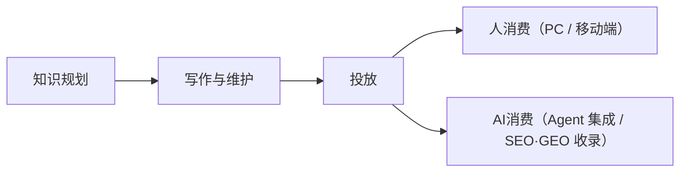

## Adoc 场景生命周期

### 一、写作

写作场景的用户是 TW 和内容维护者。一篇文档从无到有、从粗到精，经历以下生命周期：

<Steps>
<Step title="空间初始化">
基于知识规划阶段定义的知识结构去创建**知识空间和目录**。这一步决定了后续所有内容的信息架构——目录怎么分、每篇文档的定位是什么。
</Step>
<Step title="创作">
基于知识复杂度，分两种模式：

- **复杂知识体系**：采用本地 AI-Native 深度写作（TW 在 AI IDE 中用 ，结合**写作 Skill**（知识团队提供）、**目录&文档规范 Skill**（SaaS提供） ，进行AI深度创作。
- **知识结构简单**：可采用在线轻量编辑（Web Editor 处理日常修改），修改目录和内容，实现简单的快速修改。
</Step>
<Step title="评审">
内容写完后进入质量关口。经过**在线预览**、**人工评审**（协作评审流程）以及系统**质量检测**（文档格式及文档内容错误检测），保证内容质量。
</Step>
<Step title="发布">
评审通过后进入正式发布环节，发布前可完整体验最终效果，遇到问题可快速回滚。
</Step>
<Step title="维护">
内容上线后的持续迭代——版本更新、内容修订、存量文档迁入（从其他系统批量导入）。
</Step>
</Steps>

#### 对照 SaaS 能力

| **生命周期节点** | **所需能力** | **当前状态** | **能力目标效果** |
| --- | --- | --- | --- |
| **空间初始化** | 知识空间管理、目录结构管理 | ✅ 已具备 | • 具备租户下创建多空间，并且同空间可发布到多站点。 • 目录结构层次：语言、Tab、Group、Page |
| **创作** | Git 双向同步 | ✅ 已具备 | • 支持本地批量创作 |
| | 创建迭代分支 | ✅ 已具备 | • 在一个迭代中修改多篇文档 |
| | 文档格式（Markdown / MDX） | ✅ 已具备 | • 语法可读性强，对TW写作友好 • 内容信息密度高，对AI理解友好，节省Tokens消耗。_（百炼文档_[_实时语音合成-CosyVoice/Sambert_](https://help.aliyun.com/zh/model-studio/text-to-speech)_，从xdita转换成mdx，文档源码字符数减少90%，141,734 -> 12,845）_ |
| | 目录和文档规范Skill | ✅ 已具备 | • 辅助AI修改目录，使用MDX组件 |
| | MDX 写作组件（24 个） | ✅ 已具备 | • 基本覆盖绝大多数写作场景组件（Fireworks、OpenClaw、Claude Code均采用这些组件） |
| | 在线 — 目录&内容源码编辑 | ✅ 已具备 | • 调整目录层次结构、挂载文档 |
| | 在线 — 可视化编辑器 | ❌ 未支持 |  |
| **评审** | 在线预览 | ✅ 已具备 |  |
| | 人工评审流程 — Code Review | ✅ 已具备 | • 文档源码级别的Code Review |
| | 质量检测 | ❌ 部分支持 | • 目前支持文档语法检测及目录结构检测 |
| **发布** | 增量构建发布 | ✅ 已具备 | • 发布速度快 |
| | 保留上一次发布状态副本 | ✅ 已具备 | • 线上有问题可快速回滚至发布前状态 |
| | 静态 CDN 加速 | ✅ 已具备 | • 图片等媒体采用静态CDN加速 |
| | EAS 安全加速 | ⏳ 进行中 | • 采用边缘计算函数支持动态内容加速，如鉴权访问 |
| **维护** | 文档迁移 Skill | ⏳ 进行中 | • 辅助TW进行存量文档迁移，尝试空间级迁移，解决文档内链、媒体转存。 • 迁移后需要TW验证及调整。 |

### 二、投放

投放场景解决的是：写好的内容怎么送达不同站点和受众，核心概念是**租户支持多空间、同空间支持多站点**。

<Steps>
<Step title="租户开通">
一个业务对应一个租户。MaaS 站是第一个正式租户，阿里云主站、OneDay 等将来各自独立开通。
</Step>
<Step title="内容空间创建">
租户下可创建多个文档空间，每个文档空间可投放到不同站点，可实现同源多投放。
</Step>
<Step title="站点配置">
为目标站点配置域名、布局、主题样式等。这一步决定了同一份内容在不同站上的呈现差异。
</Step>
<Step title="内容分发">
将内容空间的内容投放到配置好的站点。底层是 API 级别的完整交付。
</Step>
<Step title="上线运营">
站点上线后，运营方需要自主管理内容空间、调整站点配置、查看运营数据，不依赖研发。
</Step>
</Steps>

#### 对照 SaaS 能力

| **生命周期节点** | **所需能力** | **当前状态** | **能力目标效果** |
| --- | --- | --- | --- |
| **租户开通** | 多租户管理 | ✅ 已具备 | • 针对不同的交付业务方创建租户，如： • A租户：MaaS站、阿里云主站 • B租户：OneDay |
| **内容空间** | 租户下多内容空间 | ✅ 已具备 | • 同一租户下可创建多个空间 |
| | 跨空间内容引用 | ✅ 已具备 | • 同一租户下不同空间内容可跨空间内容引用 |
| **站点配置** | 自定义域名 | ✅ 已具备 | • 同空间支持发布到不同域名站点 |
| | 自定义布局/主题样式（Logo、颜色、字体等） | ✅ 已具备 | • 不同站点定义不同的展示形式 |
| **内容分发** | 统一内容API | ✅ 已具备 | • 统一的内容API为不同站点提供内容数据 |
| **上线运营** | 运营数据 | 📋 规划中 | • 查看用户访问数据 • 查看用户反馈数据 |

### 三、人消费

内容投放到站点后，最终用户通过 PC 或移动端访问。人消费场景的生命周期是一个用户从进入到离开的完整路径：

<Steps>
<Step title="访问入口">
用户通过 PC 浏览器或移动端进入文档站。PC 端是主战场，移动端是基线覆盖。
</Step>
<Step title="信息发现">
用户进来之后怎么找到想要的内容。三层武器随内容量递进——内容少靠**目录导航**，多了靠**搜索**（AI 语义 + 全文），再多靠 **AI Assistant**（直接问问题拿答案）。
</Step>
<Step title="内容阅读">
找到内容后的消费体验。包括阅读文档、Copy as Markdown（用于AI或其他场景使用）、API 在线调试（基于 OpenAPI Spec 的交互式 Playground）、语言切换、主题切换等。
</Step>
<Step title="反馈">
点赞、点踩以及选择原因，代码块纠错。
</Step>
</Steps>

#### 对照 SaaS 能力

| **生命周期节点** | **所需能力** | **当前状态** | **能力目标效果** |
| --- | --- | --- | --- |
| **访问入口** | PC 端文档站 | ✅ 已具备 | - |
| | 响应式 / 移动端适配 | 📋 规划中 | - |
| **信息发现** | 目录导航 | ✅ 已具备 | - |
| | 全文搜索 | ⏳ 进行中 | • 信息快速检索 • 支持定位到文档及文档锚点 |
| | AI Assistant 对话问答 | ⏳ 进行中 | • 针对内容/代码块划词问答 • 对话问答，回答结果支持定位到文档及文档锚点 |
| | 404 智能推荐（优雅响应） | ❌ 未实现 |  |
| **内容阅读** | Copy as Markdown | ✅ 已具备 | • 可直接复制文档内容为Markdown格式以及打开Markdown文件，用于AI及其他场景使用 |
| | API Playground | ⏳ 进行中 | • 可在线进行API调试，快速验证API能力 |
| | 多语言切换 | ✅ 已具备 | - |
| | 主题切换 | ✅ 已具备 | - |
| **反馈** | 点赞、点踩以及选择原因 | ⏳ 进行中 | • 用于后续意图分析及意图覆盖检测 |
| | 代码块纠错 | ⏳ 进行中 | • 用于提升文档质量 |

### 四、AI 消费

当内容的消费者是 AI 时，产品要解决的是被 AI 集成的问题——系统如何被 Agent 发现、读取、调用，如何被基模收录。

**Agent消费：** 当开发者在Claude Code中提问、或在OpenClaw中构建集成流程时，Agent能够准确地从我们的文档中获取信息并给出正确答案。

平台在内容发布的同时自动完成AI消费所需的全部准备工作：自动生成llms.txt（站点内容摘要索引）和llms-full.txt（全站内容聚合），供Agent快速理解站点全貌；每页文档提供.md格式直接访问路径，供Agent提取结构化内容；Open API接口支持编程式的内容检索和获取；MCP协议支持实时上下文传递。

**基模消费：** 通过SEO和GEO策略优化，确保文档内容被搜索引擎高质量收录（SEO），同时被AI搜索引擎和大模型训练流程正确引用（GEO）。

平台提供结构化元数据管理、站点地图自动生成、语义化内容输出等基础能力，站点运营者基于此配置和优化具体的SEO/GEO策略。

#### 对照 SaaS 能力

| **生命周期节点** | **所需能力** | **当前状态** | **能力目标效果** |
| --- | --- | --- | --- |
| **Agent & 基模消费** | llms.txt 自动生成 | ✅ 已具备 | 全站内容目录 |
| | llms-full.txt 自动生成 | ✅ 已具备 | 全站内容 |
| | .md 文件自动生成 | ✅ 已具备 | 文档级别的md |
| | AI 调用 - Skills + CLI | ✅ 已具备 | 比MCP更优 |
| | 文档支持 Frontmatter | ✅ 已具备 | 包含TDK、OG等，支持被搜索引擎消费 |
